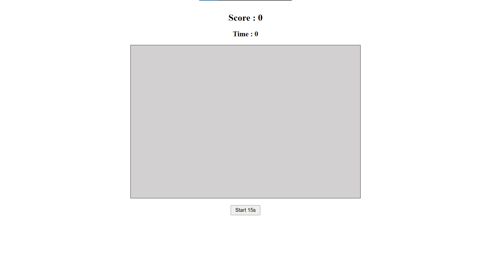

# 🖱️ClickChamp Game
Play game :   https://piyuscoder.github.io/ClickChamp/

A simple mouse clicker game built using **HTML**, **CSS**, and **JavaScript**. Click as many times as you can in **15 seconds** and challenge your clicking speed!

## 🚀 Features

- ⏱️ 15-second countdown timer
- 🟦 Clickable box to increase score
- 📈 Real-time score counter
- 💻 Responsive layout

## 🎮 How to Play

1. Click on the **Start** button.
2. A 15-second timer will begin.
3. Click inside the ** box** as fast as you can.
4. Your **score** will be displayed after time is up.

## 🧑‍💻 Tech Stack

- HTML5
- CSS3
- JavaScript

## 📸 Screenshot

 <!-- Replace with your actual image file -->

## 📂 Folder Structure
ClickChamp/
│
├── index.html
├── style.css
├── script.js
└── README.md

📢 Author
Name: Piyush
GitHub: piyuscoder

© 2025 Piyush.
